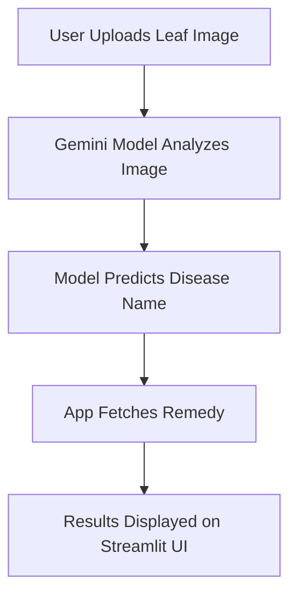

# 🌿 Leaf Disease Detection using Gemini AI

##  Description
An AI-powered web application that detects plant leaf diseases using the **Google Gemini Vision Model** and provides instant remedies.  
Developed for the **EONVERSE AI Intern Screening Challenge (Applied AI Build Challenge)**, this project showcases how AI can support sustainable farming through quick disease detection and treatment suggestions.

Built with **Streamlit**, the app allows users to upload a leaf image, automatically identifies the disease using Gemini AI, and recommends the best remedy — making it practical for farmers and agricultural experts.

---

## 🎯 Objective
- Detect plant leaf diseases from uploaded images.
- Suggest accurate remedies for each detected disease.
- Demonstrate AI-powered decision-making using the Gemini Vision model.

---

## 🧠 Tools & Technologies
- **Python 3**
- **Streamlit** – Web application framework
- **Google Gemini API** – Image analysis & classification
- **Pillow (PIL)** – Image processing
- **io** – Image byte handling

---

## ⚙️ Workflow



**Step-by-Step Process:**
1. User uploads a leaf image.
2. The image is processed and sent to the **Gemini Vision model**.
3. The model identifies the disease and returns the result.
4. The app matches the disease to a **remedy dictionary**.
5. The results and suggestions are displayed in real-time.

---

## 💻 Code Snippet

```python
# Send image to Gemini Vision Model
response = vision_model.generate_content(
    [image_dict, "Identify the leaf disease and provide a short name."]
)

# Extract model response
detected_disease = response.text.strip()

# Display result and remedy
st.subheader("🩺 Detected Disease:")
st.write(detected_disease)

remedy = disease_remedies.get(
    detected_disease, "Consult an agricultural expert for further advice."
)
st.subheader("💡 Suggested Remedy:")
st.write(remedy)
```

---

## 📊 Results & Observations
- The app successfully detects common plant leaf diseases like **Powdery Mildew, Rust, and Leaf Blight**.
- Displays **remedy suggestions instantly** after detection.
- Demonstrates smooth integration of **AI image analysis** and **Streamlit UI**.
- Helps farmers identify plant health issues early.

---

## 💡 Learnings & Future Enhancements
**Learnings:**
- Integration of **Google Gemini API** for real-world AI image classification.
- Hands-on experience with **Streamlit** for AI app deployment.
- Enhanced understanding of how AI can assist in smart agriculture.

**Future Enhancements:**
- Replace Gemini with a **custom-trained YOLO model** for offline use.
- Add **multi-language support** for farmers.
- Integrate **weather and soil data** for better predictions.
- Include **disease severity detection** and preventive advice.

---

## ⚙️ Installation & Setup

1. **Clone the Repository**
   ```bash
   git clone https://github.com/MOUNIKA-LOYA/Leaf-Disease-Detection-Gemini.git
   cd Leaf-Disease-Detection-Gemini
   ```

2. **Create a Virtual Environment**
   ```bash
   python -m venv venv
   venv\Scripts\activate
   ```

3. **Install Dependencies**
   ```bash
   pip install -r requirements.txt
   ```

4. **Run the Application**
   ```bash
   streamlit run app.py
   ```

5. **Access the App**
   The app will open in your browser at `http://localhost:8501`.

---

## 🎥 Demo Video
 **Watch the working demo below:**  
👉 [**Leaf Disease Detection Demo Video (Google Drive)**](https://drive.google.com/file/d/1WqUvZ2AHtQeqGqS2BhAIJLqiWfB43gcw/view?usp=sharing)

---

## 📎 Project Links
- **GitHub Repository:** [Leaf Disease Detection - Gemini AI](https://github.com/MOUNIKA-LOYA/Leaf-Disease-Detection-Gemini)
- **Demo Video:** [Google Drive Link](https://drive.google.com/file/d/1WqUvZ2AHtQeqGqS2BhAIJLqiWfB43gcw/view?usp=sharing)

---

## 👩‍💻 Author
**Loya Mounika**  
 B.Tech (Information Technology)  
 Aspiring Data Scientist | AI & ML Enthusiast  
 India  


